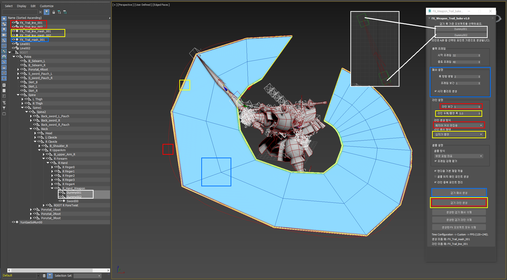
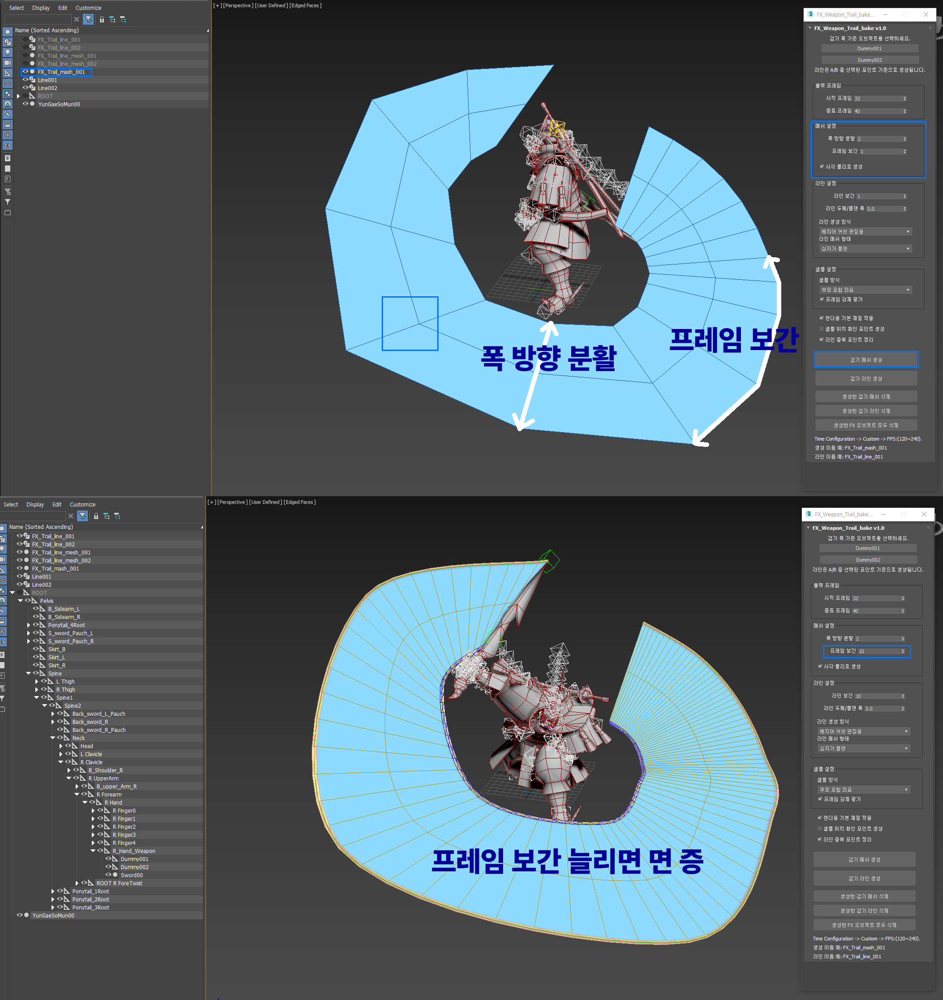
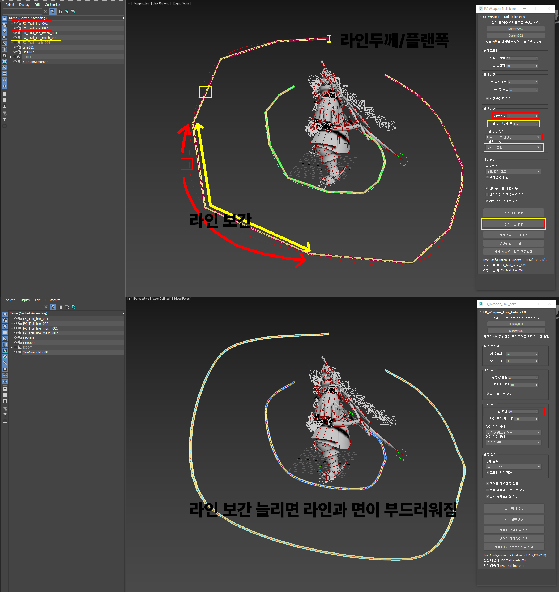
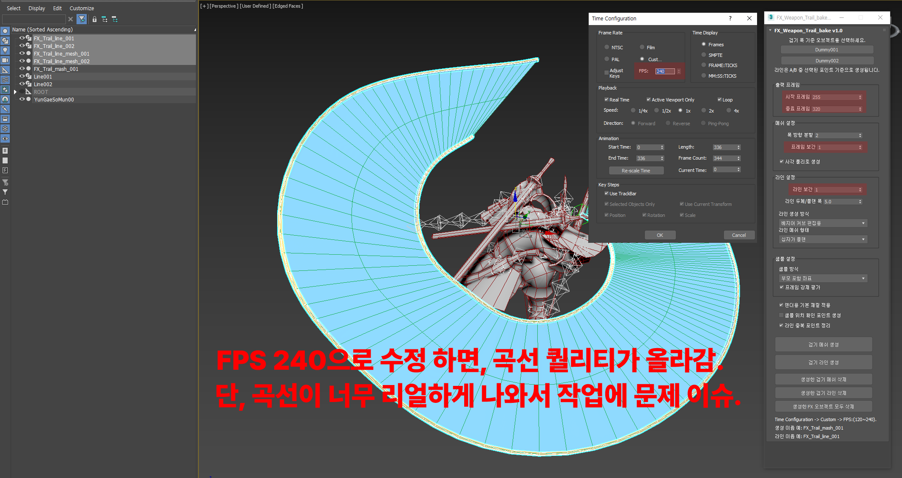

# FX_Weapon_Trail_bake_v1.0

`FX_Weapon_Trail_bake_v1.0`은 3ds Max용 MaxScript 툴입니다.  
무기 궤적, 검기, 베기 이펙트 제작을 위해 애니메이션된 Point 오브젝트를 기준으로 트레일 메쉬와 라인 메쉬를 자동 생성합니다.

## Preview









## youtube
적용 방법 설명 영상
https://youtu.be/tibLFGPDHNk

## Features

- Point A / Point B 기준으로 검기 트레일 메쉬 생성
- A 또는 B 포인트 기준으로 라인 생성
- A/B 포인트 둘 다 선택 시 각각 라인 생성
- 직선 라인 / 베지어 커브 편집용 라인 지원
- 실린더형 라인 메쉬 생성 지원
- 십자가 플랜 형태의 라인 메쉬 생성 지원
- 라인 중복 포인트 정리 기능
- 샘플 위치 확인용 Debug Point 생성 기능
- 생성된 메쉬 / 라인 / 전체 FX 오브젝트 삭제 기능
- 기본 렌더용 재질 자동 적용
- 생성된 패스(Trail line)에 "Loft" 또는 "Path Deform" 적용 가능

  (Loft : 패스에 line(splines)을 적용 하는 방식)

  (Path Deform :Plane(mesh)에 패스를 적용 하는 방식)


## Compatibility

- 3ds Max 2018 이상을 기준으로 제작
- MaxScript 실행 방식 사용
- UI 언어: 한국어
- 생성 오브젝트 이름: 영어 기반

## Installation

1. `FX_Weapon_Trail_bake_v1.0.ms` 파일을 다운로드합니다.
2. 3ds Max를 실행합니다.
3. 상단 메뉴에서 아래 경로로 실행합니다.

```text
Scripting → Run Script...
```

4. `FX_Weapon_Trail_bake_v1.0.ms` 파일을 선택합니다.
5. `FX_Weapon_Trail_bake v1.0` 창이 열리면 사용하면 됩니다.

## Basic Workflow

1. 검기 폭의 양쪽 기준이 될 Point 오브젝트 2개를 준비합니다.
2. Point A와 Point B를 무기 또는 본에 연결합니다.
3. 시작 프레임과 종료 프레임을 입력합니다.
4. `검기 메쉬 생성` 또는 `검기 라인 생성` 버튼을 누릅니다.
5. 생성된 메쉬를 확인하고 필요하면 재질, UV, 모양을 수정합니다.

## UI Options

### Point Selection

| 옵션 | 설명 |
|---|---|
| 검기 폭 A 포인트 | 검기 폭의 한쪽 기준 Point를 선택합니다. |
| 검기 폭 B 포인트 | 검기 폭의 반대쪽 기준 Point를 선택합니다. |

메쉬 생성은 A/B 포인트가 모두 필요합니다.  
라인 생성은 A 또는 B 중 하나만 선택해도 생성할 수 있습니다.

### 출력 프레임

| 옵션 | 기본값 | 설명 |
|---|---:|---|
| 시작 프레임 | 0 | 샘플링을 시작할 프레임입니다. |
| 종료 프레임 | 10 | 샘플링을 끝낼 프레임입니다. |

입력한 프레임 구간을 기준으로 Point 위치를 샘플링하여 메쉬 또는 라인을 생성합니다.

### 메쉬 설정

| 옵션 | 기본값 | 설명 |
|---|---:|---|
| 폭 방향 분할 | 2 | A/B 포인트 사이의 폭 방향 분할 수입니다. |
| 프레임 보간 | 1 | 프레임 사이에 추가 샘플을 넣어 더 부드러운 트레일을 만듭니다. |
| 사각 폴리로 생성 | ON | 생성 결과를 사각 폴리 형태로 정리합니다. |

`프레임 보간` 값을 높이면 궤적이 더 부드러워지지만 정점과 면 수가 증가합니다.

### 라인 설정

| 옵션 | 기본값 | 설명 |
|---|---:|---|
| 라인 보간 | 1 | 라인 생성 시 프레임 사이에 추가 샘플을 넣습니다. |
| 라인 두께/플랜 폭 | 5.0 | 실린더 라인의 두께 또는 십자가 플랜의 폭으로 사용됩니다. |
| 라인 생성 방식 | 베지어 커브 편집용 | 생성할 라인의 형태를 선택합니다. |
| 라인 메쉬 형태 | 십자가 플랜 | 라인 렌더 메쉬 생성 방식을 선택합니다. |

#### 라인 생성 방식

| 방식 | 설명 |
|---|---|
| 직선 라인 | 샘플 포인트를 직선으로 연결한 라인을 생성합니다. |
| 베지어 커브 편집용 | 생성 후 커브 편집이 가능한 베지어 라인을 생성합니다. |

#### 라인 메쉬 형태

| 방식 | 설명 |
|---|---|
| 생성 안 함 | 라인 Shape만 생성합니다. |
| 실린더 | 3ds Max Spline Render 기반의 원통형 라인을 생성합니다. |
| 십자가 플랜 | 두 장의 Plane이 교차된 십자가 형태의 저폴리 라인 메쉬를 생성합니다. |

`십자가 플랜`은 게임 이펙트용 라인, 검기 잔상, 에너지 라인에 사용하기 좋습니다.

### 샘플 설정

| 옵션 | 기본값 | 설명 |
|---|---:|---|
| 샘플 방식 | 부모 포함 좌표 | Point의 위치를 어떤 좌표 기준으로 읽을지 선택합니다. |
| 프레임 강제 평가 | ON | 각 프레임에서 씬을 강제로 평가한 뒤 위치를 샘플링합니다. |
| 렌더용 기본 재질 적용 | ON | 생성된 오브젝트에 기본 재질을 자동 적용합니다. |
| 샘플 위치 확인 포인트 생성 | OFF | 샘플링된 위치에 확인용 Point를 생성합니다. |
| 라인 중복 포인트 정리 | ON | 거의 같은 위치의 라인 포인트를 정리합니다. |

#### 샘플 방식

| 방식 | 설명 |
|---|---|
| 부모 포함 좌표 | 부모 오브젝트의 움직임을 포함하여 위치를 계산합니다. |
| 월드 좌표 | 월드 좌표 기준으로 위치를 가져옵니다. |
| 트랜스폼 위치 | 오브젝트 Transform의 위치값을 사용합니다. |
| 원본 pos | 오브젝트의 기본 pos 값을 사용합니다. |

일반적으로 리깅된 무기나 본에 Point가 연결되어 있다면 `부모 포함 좌표`를 먼저 사용하는 것을 권장합니다.

## Buttons

| 버튼 | 설명 |
|---|---|
| 검기 메쉬 생성 | A/B 포인트 기준으로 트레일 메쉬를 생성합니다. |
| 검기 라인 생성 | 선택된 A/B 포인트 기준으로 라인을 생성합니다. |
| 생성한 검기 메쉬 삭제 | 이 툴로 생성한 검기 메쉬를 삭제합니다. |
| 생성한 검기 라인 삭제 | 이 툴로 생성한 라인 오브젝트를 삭제합니다. |
| 생성한 FX 오브젝트 모두 삭제 | 이 툴로 생성한 메쉬와 라인을 모두 삭제합니다. |

## Generated Object Names

기본 생성 이름은 다음 형식을 사용합니다.

```text
FX_Trail_mash_001
FX_Trail_line_001
FX_Trail_line_mesh_001
```

이미 같은 이름의 오브젝트가 있으면 자동으로 다음 번호가 붙습니다.

```text
FX_Trail_mash_002
FX_Trail_line_002
FX_Trail_line_mesh_002
```

## Recommended Settings

### 검기 트레일 메쉬

| 옵션 | 추천값 |
|---|---:|
| 폭 방향 분할 | 2 |
| 프레임 보간 | 1 |
| 사각 폴리로 생성 | ON |
| 샘플 방식 | 부모 포함 좌표 |
| 프레임 강제 평가 | ON |

### 라인 / 에너지 이펙트

| 옵션 | 추천값 |
|---|---:|
| 라인 보간 | 1 |
| 라인 두께/플랜 폭 | 5.0 |
| 라인 생성 방식 | 베지어 커브 편집용 |
| 라인 메쉬 형태 | 십자가 플랜 |
| 라인 중복 포인트 정리 | ON |

## Notes

- 시작 프레임보다 종료 프레임이 커야 합니다.
- Point가 거의 움직이지 않으면 메쉬 또는 라인이 제대로 생성되지 않을 수 있습니다.
- 애니메이션이 부모 오브젝트에 들어가 있다면 `부모 포함 좌표`를 사용해보세요.
- 라인 결과가 너무 각져 보이면 `라인 보간` 값을 올려보세요.
- 메쉬 결과가 너무 무거우면 `프레임 보간` 값을 낮춰보세요.
- 십자가 플랜 메쉬는 저폴리 이펙트 제작에 적합합니다.

## License

Personal / production use allowed.  
Modify freely for your own workflow.
